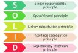

# Практика 20.10.1 (HW-04) # 

<table>
  <tr>
    <td>
      <a href="https://blog.skillfactory.ru/printsipy-solid-v-programmirovanii/?ysclid=m21xh8gb71203555266"></img></a></td>
    <td>
      Учебное задание 20.10.1 (HW-04) <a href="https://skillfactory.ru/">Skillfactory</a>  
      Выполнил студент <a href="https://github.com/Vlad-Miroshin">Владислав Мирошин</a> поток PHPPRO_22 
    </td>
  </tr>
</table>

### DRY

### KISS

- [Применение метода массива 'reduce' вместо цикла](./partials/kiss/sample_1.md)
- [Применение метода массива 'map' вместо цикла](./partials/kiss/sample_2.md)

### YAGNI

- [Удаление неиспользуемых методов класса](./partials/yagni/sample_1.md)

### SOLID

### Проверка семантики и валидности вёрстки

- [Проверка валидатором W3C верстки лендинга модуля 18](./partials/w3c/sample_1.md)

### BEM

